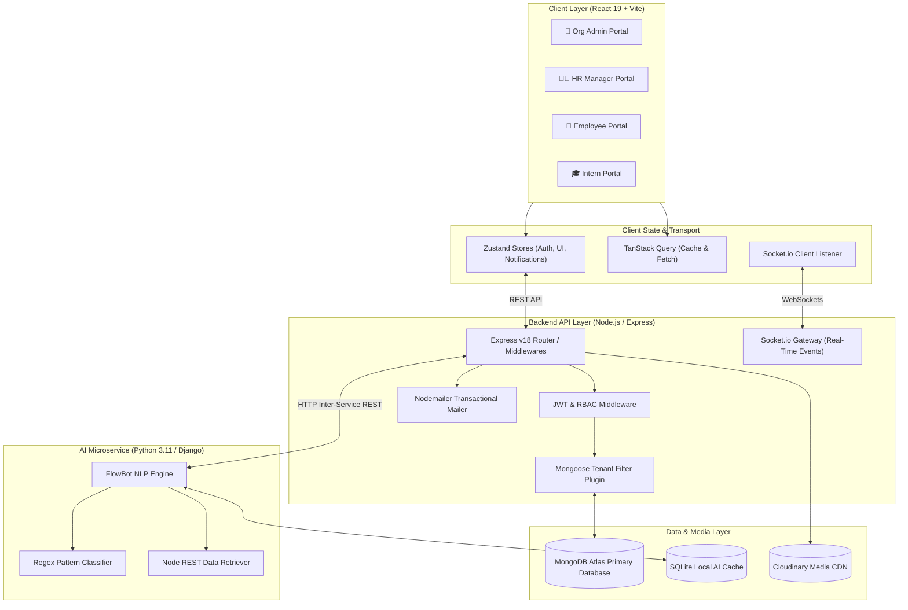
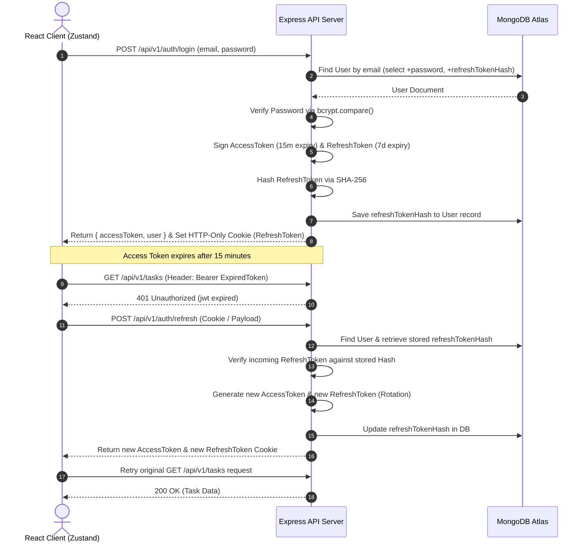
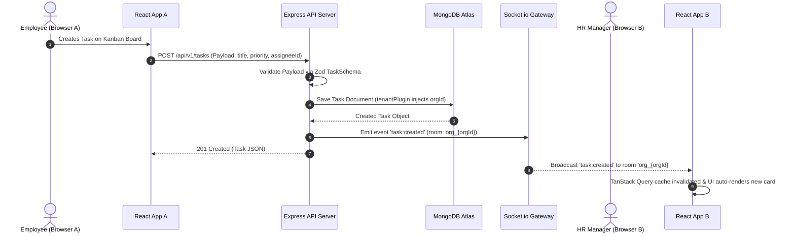
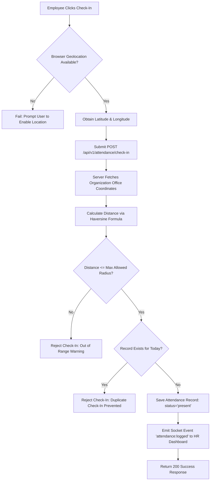
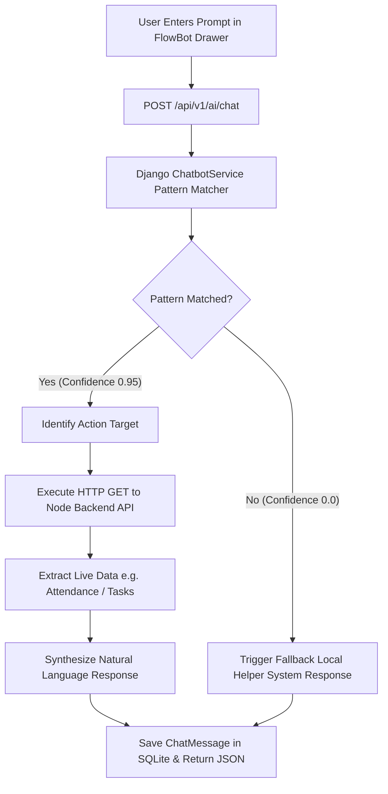

# ⚡ FlowGen — Master Technical & Architectural Specification

> **Official Comprehensive Project Documentation (A-Z)**  
> *Everything required to understand, develop, deploy, and maintain the FlowGen Workforce Operating System.*

---

## 1. Title Block

| Attribute | Details |
| :--- | :--- |
| **Project Name** | **FlowGen** |
| **Repository URL** | [https://github.com/Mokshilxhah/Flowgen](https://github.com/Mokshilxhah/Flowgen) |
| **Architecture Model** | Multi-Tenant Distributed Micro-Monolith (React SPA ↔ Node.js Express API ↔ Python Django AI Service) |
| **Current Version / Status** | `v1.0.0` / Production Ready |
| **One-Line Motto** | *The Intelligent Workforce Operating System — One unified platform for Org Admins, HR, Employees, and Interns.* |

---

## 2. Table of Contents

| Section # | Section Title | Primary Contents |
| :---: | :--- | :--- |
| **[1](#1-title-block)** | Title Block | Project metadata, repository link, architecture model, and status |
| **[2](#2-table-of-contents)** | Table of Contents | Section navigation matrix |
| **[3](#3-executive-summary--vision)** | Executive Summary & Vision | Core value proposition & problem-solution alignment table |
| **[4](#4-complete-tech-stack-breakdown)** | Complete Tech Stack Breakdown | Mermaid layer connections & technology breakdown tables |
| **[5](#5-folder-structure--file-directory-map)** | Folder Structure & File Directory Map | Comprehensive multi-tier codebase tree with inline file descriptions |
| **[6](#6-database-schemas--data-models)** | Database Schemas / Data Models | 17 MongoDB/Mongoose data models with field-by-field specifications |
| **[7](#7-end-to-end-system-workflows)** | End-to-End System Workflows | Mermaid sequence & flowchart diagrams for key operational flows |
| **[8](#8-feature-internal-mechanics--algorithms)** | Feature Internal Mechanics & Algorithms | Mathematical formulas, tenant isolation logic, and algorithmic mechanics |
| **[9](#9-complete-api-endpoints--contracts)** | Complete API Endpoints & Contracts | Complete REST endpoint specification tables grouped by resource |
| **[10](#10-frontend-architecture--design-system)** | Frontend Architecture & Design System | HSL color tokens, typography, glassmorphism utilities & ASCII page layouts |
| **[11](#11-state-management-hooks--services)** | State Management, Hooks & Services | Zustand stores and API service layer mappings |
| **[12](#12-aiml-engine--fallback-architecture)** | AI/ML Engine & Fallback Architecture | FlowBot intent parsing, regex engine, and Node backend relay logic |
| **[13](#13-security-auth--rbac)** | Security, Auth & RBAC | JWT access/refresh token lifecycle & role permission matrix |
| **[14](#14-architectural-decision-records-adrs)** | Architectural Decision Records (ADRs) | 6 Core tech decisions with rationale & trade-off analysis |
| **[15](#15-a-z-feature-matrix)** | A-Z Feature Matrix | Role capability matrix across all 4 system portals |
| **[16](#16-installation-setup--connectivity-guide)** | Installation, Setup & Connectivity Guide | Prerequisites table and step-by-step startup instructions |
| **[17](#17-faq)** | FAQ | Answers to key developer and architectural questions |
| **[18](#18-footer)** | Footer | Maintainer info, repository links, and licensing |

---

## 3. Executive Summary & Vision

**FlowGen** is a modern, real-time workforce operating system designed to bridge operational gaps between corporate leadership, HR management, core engineering/operations teams, and incoming interns. Traditional enterprise tools force organizations to juggle separate apps for task tracking, attendance, internal communications, onboarding, and AI assistance. FlowGen unifies all five operational pillars into a single, high-performance, role-tailored dashboard experience.

### Problem vs. Solution Matrix

| Problem | Root Cause | FlowGen Solution |
| :--- | :--- | :--- |
| **Fragmented Portal Tooling** | Teams use Jira for tasks, Slack for messaging, BambooHR for attendance, and Notion for docs. | **Unified Multi-Portal Operating System**: 4 role-tailored views (Admin, HR, Employee, Intern) backed by a shared real-time data engine. |
| **Cross-Tenant Data Leakage Risk** | Multi-tenant SaaS platforms often rely on manual `where` clauses, leaving room for query leaks. | **Automated Plugin-Level Multi-Tenancy**: Custom Mongoose plugin automatically injects `orgId` filtering across all query hooks. |
| **Loss of Real-Time Awareness** | Polling REST APIs delays status updates for attendance, task changes, and chat alerts. | **Bidirectional Socket.io Engine**: Instant push updates for tasks, Kanban state changes, user presence, and live notifications. |
| **AI Dependency Bottlenecks** | External LLM APIs can be expensive, slow, or fail due to rate limits/outages. | **Hybrid Deterministic AI Engine**: Fast regex intent recognition with local Node API dataset retrieval fallback when LLMs are offline. |
| **Disjointed Intern Onboarding** | Interns are left out of core task boards and struggle with fragmented learning materials. | **Structured Intern Portal**: Dedicated learning path progress trackers, mentor pairing, and simplified Kanban boards. |

---

## 4. Complete Tech Stack Breakdown

### System Layer Connections



### Stack Specifications

#### Frontend Stack
| Tool / Library | Version | Purpose & Usage |
| :--- | :--- | :--- |
| **React** | `19.0.0` | UI component library utilizing modern hooks and concurrent rendering |
| **Vite** | `8.x` | High-speed frontend build tool and dev server with HMR |
| **Tailwind CSS** | `3.4.x` | Utility-first CSS framework with custom glassmorphism design system |
| **Zustand** | `5.x` | Lightweight global client state management (Auth, UI, Notifications) |
| **TanStack Query** | `5.x` | Server-state fetching, caching, deduplication, and optimistic mutations |
| **Socket.io-client** | `4.x` | Real-time WebSocket connection to Node.js backend |
| **Framer Motion** | `11.x` | UI transition animations, page mounts, and micro-interactions |
| **Lucide React** | `0.4x` | Modern icon library |
| **React Big Calendar** | `1.x` | Calendar schedule visualization for meetings and events |

#### Backend Stack
| Tool / Library | Version | Purpose & Usage |
| :--- | :--- | :--- |
| **Node.js** | `18.x / 20.x` | Server runtime environment |
| **Express.js** | `4.x` | Web application framework for RESTful API routes and middleware |
| **Mongoose** | `8.x` | MongoDB ODM with custom schema plugins and indexes |
| **Socket.io** | `4.x` | Bidirectional real-time event server |
| **jsonwebtoken** | `9.x` | Secure JWT signing, verification, and rotation |
| **bcryptjs** | `2.4.x` | Password hashing (12 salt rounds) |
| **Zod** | `3.x` | Runtime schema validation for request payloads |
| **Nodemailer** | `6.x` | Transactional email generation via Gmail SMTP |
| **Multer** | `1.4.x` | Multipart form-data handling for file uploads |

#### AI & Auxiliary Stack
| Tool / Library | Version | Purpose & Usage |
| :--- | :--- | :--- |
| **Python** | `3.11+` | AI service runtime environment |
| **Django** | `5.x` | Web framework for AI microservice endpoint management |
| **Django REST Framework**| `3.15.x` | REST serialization for AI endpoints |
| **Gunicorn** | `22.x` | WSGI HTTP Server for UNIX deployment |
| **MongoDB Atlas** | Cloud | Managed NoSQL primary database |
| **Cloudinary** | Cloud | Persistent avatar and document file storage CDN |

---

## 5. Folder Structure & File Directory Map

```
flowgen/
├── README.md                      # Primary project overview & quickstart guide
├── DEPLOYMENT_BRIEF.md            # Detailed deployment instructions & environment checklist
├── start-dev.bat                  # Windows batch script to trigger concurrent dev servers
├── client/                        # React 19 Frontend Application
│   ├── index.html                 # Main HTML entry point
│   ├── vite.config.js             # Vite configuration and proxy rules
│   ├── tailwind.config.js         # Custom colors, fonts, and animation extensions
│   ├── vercel.json                # Single Page App routing rewrite rules for Vercel
│   ├── package.json               # Frontend dependencies & scripts
│   └── src/
│       ├── main.jsx               # React DOM bootstrap file with QueryClientProvider
│       ├── index.css              # Custom Tailwind directives & glassmorphism theme tokens
│       ├── assets/                # Static assets, branding, and images
│       ├── components/            # Reusable UI Components
│       │   ├── common/            # Buttons, Modals, Inputs, Badge, GlassCard, LoadingSpinner
│       │   ├── layout/            # Navbar, Sidebar, PageContainer, RoleGuard
│       │   ├── kanban/            # KanbanBoard, KanbanColumn, TaskCard, TaskModal
│       │   ├── calendar/          # EventCalendar, ScheduleMeetingModal
│       │   └── chat/              # ChatWidget, FlowBotDrawer, MessageList
│       ├── lib/
│       │   ├── api.js             # Axios client instance with request/response interceptors
│       │   └── socket.js          # Socket.io connection initializer and listener hooks
│       ├── store/
│       │   ├── authStore.js       # Zustand auth store (user, token, login, logout, refresh)
│       │   ├── notificationStore.js# Live notifications state & unread counts
│       │   └── uiStore.js         # Theme selection, sidebar state, active modals
│       ├── utils/
│       │   ├── formatters.js      # Date, currency, and string helper functions
│       │   └── constants.js       # UI constants, role enums, navigation links
│       └── pages/
│           ├── auth/              # Login, Register, ForgotPassword, ResetPassword
│           ├── org/               # Admin Dashboard, Member Management, Billing, Settings
│           ├── hr/                # HR Dashboard, Team Management, Projects, Attendance Reports
│           ├── employee/          # Employee Dashboard, My Tasks, Attendance Check-In
│           ├── intern/            # Intern Dashboard, Learning Path, Mentor Chat
│           ├── shared/            # Profile, Settings, Notifications, HelpCenter
│           └── landing/           # Public Landing Page & Feature Showcase
├── server/                        # Node.js Express REST API & Socket Gateway
│   ├── package.json               # Server dependencies & scripts
│   └── src/
│       ├── index.js               # Entry point: HTTP server & Socket.io initialization
│       ├── app.js                 # Express app configuration, CORS, and route mounting
│       ├── config/
│       │   ├── db.js              # MongoDB Atlas connection lifecycle handler
│       │   └── constants.js       # Global constants, roles, and status enums
│       ├── middleware/
│       │   ├── auth.middleware.js # JWT verification and req.user attachment
│       │   ├── rbac.middleware.js # Role permission gatekeeper
│       │   ├── error.middleware.js# Centralized HTTP error handler
│       │   ├── validate.middleware.js# Zod schema validation interceptor
│       │   └── upload.middleware.js# Multer storage configuration (Disk/Cloudinary)
│       ├── models/                # Mongoose Database Schemas
│       │   ├── plugins/
│       │   │   └── tenantPlugin.js# Automatic orgId injection plugin for multi-tenancy
│       │   ├── Organization.js    # Tenant workspace model
│       │   ├── User.js            # User accounts & RBAC profiles
│       │   ├── Team.js            # Departmental teams & leader mappings
│       │   ├── Project.js         # Project specifications & milestone arrays
│       │   ├── Task.js            # Kanban tasks, subtasks, comments, attachments
│       │   ├── Sprint.js          # Agile sprint periods & task links
│       │   ├── Attendance.js      # Geofenced check-in/out logs & hour calculations
│       │   ├── Meeting.js         # Scheduled meetings & room links
│       │   ├── ChatRoom.js        # Real-time channel metadata
│       │   ├── ChatMessage.js     # Room messaging logs
│       │   ├── Message.js         # Direct user-to-user messages
│       │   ├── Notification.js    # System & activity notifications
│       │   ├── Alert.js           # High-priority org-wide broadcast announcements
│       │   ├── OTPVerification.js # Email verification & password reset OTP tokens
│       │   ├── LearningProgress.js# Intern module progress & completion tracker
│       │   ├── Resource.js        # Shared documentation & links
│       │   └── Activity.js        # Audit trail activity logs
│       ├── routes/                # Express Endpoint Definitions (19 route files)
│       ├── controllers/           # Business Logic Controllers
│       ├── services/              # Shared Services (email, storage, socket emitter)
│       ├── templates/             # Nodemailer HTML responsive email templates
│       ├── validators/            # Zod validation schemas
│       └── utils/                 # Token generators, password hashers, helper utilities
└── ai-service/                    # Python Django AI Microservice
    ├── manage.py                  # Django administrative script
    ├── requirements.txt           # Python dependency list
    ├── flowgen_ai/                # Django project settings & WSGI configuration
    │   ├── settings.py            # Main Django configuration & CORS origins
    │   └── wsgi.py                # WSGI entry point for Gunicorn
    └── ai_chat/                   # FlowBot AI Application
        ├── models.py              # ChatSession & ChatMessage models (SQLite)
        ├── views.py               # REST view handlers (/chat, /history, /health)
        └── services/
            └── chatbot_service.py # Regex intent parser & Node REST dataset fetcher
```

---

## 6. Database Schemas / Data Models

### 1. Organization Schema (`Organization.js`)
| Field | Type & Indexing | Validation & Notes |
| :--- | :--- | :--- |
| `_id` | `ObjectId` | Primary key |
| `name` | `String` | Required, trimmed organization name |
| `domain` | `String` | Required, lowercase, trimmed, **Unique Index** |
| `industry` | `String` | Default: `'Technology'` |
| `logo` | `String` | URL link to organization logo asset |
| `plan` | `String` | Enum: `['free', 'pro', 'enterprise']`, Default: `'free'` |
| `adminId` | `ObjectId` | Reference to `User` model (Org Admin) |
| `isActive` | `Boolean` | Default: `true` |
| `billingEmail` | `String` | Optional contact email for invoices |
| `membersCount` | `Object` | Embedded object: `{ hr: Number, employees: Number, interns: Number }` |
| `settings` | `Object` | Includes `allowSelfRegistration` (Boolean) and `workHours` (`start`, `end`) |
| `subscription` | `Object` | Includes `planId`, `status` (`active`, `cancelled`, `past_due`), `renewsAt` |

### 2. User Schema (`User.js`)
| Field | Type & Indexing | Validation & Notes |
| :--- | :--- | :--- |
| `_id` | `ObjectId` | Primary key |
| `orgId` | `ObjectId` | **Indexed**, ref `Organization`, Tenant boundary |
| `name` | `String` | Required, trimmed full name |
| `companyEmail` | `String` | Required, lowercase, trimmed. **Compound Index with `orgId`** |
| `personalEmail` | `String` | Optional backup email |
| `password` | `String` | Required, hashed using bcrypt (12 rounds), `select: false` |
| `role` | `String` | **Indexed**, Enum: `['org_admin', 'hr', 'employee', 'intern']` |
| `avatar` | `String` | Cloudinary asset URL |
| `department` | `String` | Optional department tag |
| `designation` | `String` | Job title |
| `managerId` | `ObjectId` | Optional ref `User` |
| `teamId` | `ObjectId` | Optional ref `Team` |
| `isTeamLeader` | `Boolean` | Default: `false` |
| `status` | `String` | Enum: `['active', 'inactive', 'suspended', 'pending']`, Default: `'active'` |
| `refreshTokenHash` | `String` | Hashed refresh token, `select: false` |
| `preferences` | `Object` | Includes theme preference (`dark`, `dusk`, `light`) and notification toggles |

### 3. Attendance Schema (`Attendance.js`)
| Field | Type & Indexing | Validation & Notes |
| :--- | :--- | :--- |
| `_id` | `ObjectId` | Primary key |
| `orgId` | `ObjectId` | **Indexed**, ref `Organization` |
| `userId` | `ObjectId` | **Indexed**, ref `User` |
| `date` | `Date` | Required date of attendance record |
| `checkIn` | `Date` | Timestamp of check-in |
| `checkOut` | `Date` | Timestamp of check-out |
| `status` | `String` | Enum: `['present', 'absent', 'late', 'half_day', 'wfh', 'leave']` |
| `hoursWorked` | `Number` | Calculated total active hours |
| `note` | `String` | User note or reason for WFH/leave |
| `approvedBy` | `ObjectId` | Optional ref `User` (HR approval) |
| **Indexes** | `Compound` | **Unique Index on (`orgId`, `userId`, `date`)** |

### 4. Task Schema (`Task.js`)
| Field | Type & Indexing | Validation & Notes |
| :--- | :--- | :--- |
| `_id` | `ObjectId` | Primary key |
| `orgId` | `ObjectId` | **Indexed**, ref `Organization` |
| `projectId` | `ObjectId` | **Indexed**, ref `Project` |
| `teamId` | `ObjectId` | Optional ref `Team` |
| `title` | `String` | Required, trimmed title |
| `description` | `String` | Task details |
| `assigneeId` | `ObjectId` | Required ref `User` |
| `createdBy` | `ObjectId` | Required ref `User` |
| `status` | `String` | **Indexed**, Enum: `['todo', 'in_progress', 'in_review', 'completed']` |
| `priority` | `String` | Enum: `['low', 'medium', 'high', 'urgent']` |
| `storyPoints` | `Number` | Default: `0` |
| `dueDate` | `Date` | Target completion date |
| `estimatedHours` | `Number` | Target duration |
| `loggedHours` | `Number` | Accumulated effort logged |
| `subtasks` | `Array[Object]`| Items containing `{ id, title, isCompleted, completedBy, completedAt }` |
| `comments` | `Array[Object]`| Items containing `{ id, userId, text, reactions, createdAt }` |
| `attachments` | `Array[Object]`| Items containing `{ id, name, url, uploadedBy, uploadedAt }` |
| `position` | `Number` | Ordering index within Kanban column |

### 5. Project Schema (`Project.js`)
| Field | Type & Indexing | Validation & Notes |
| :--- | :--- | :--- |
| `_id` | `ObjectId` | Primary key |
| `orgId` | `ObjectId` | **Indexed**, ref `Organization` |
| `name` | `String` | Required project name |
| `description` | `String` | Overview |
| `assignedHrId` | `ObjectId` | Required ref `User` (HR owner) |
| `teamIds` | `Array[ObjectId]`| List of associated `Team` refs |
| `status` | `String` | **Indexed**, Enum: `['planning', 'active', 'on_hold', 'completed', 'cancelled']` |
| `priority` | `String` | Enum: `['low', 'medium', 'high', 'urgent']` |
| `startDate` | `Date` | Project kick-off |
| `deadline` | `Date` | Target end date |
| `progress` | `Number` | Auto-calculated percentage (0-100) based on task completion |
| `milestones` | `Array[Object]`| Sub-milestones: `{ id, title, dueDate, completedAt, status }` |

### 6. Team Schema (`Team.js`)
| Field | Type & Indexing | Validation & Notes |
| :--- | :--- | :--- |
| `orgId` | `ObjectId` | **Indexed**, ref `Organization` |
| `name` | `String` | Required team name |
| `type` | `String` | Enum: `['frontend', 'backend', 'design', 'qa', 'devops', 'other']` |
| `leaderId` | `ObjectId` | Ref `User` (Team Lead) |
| `memberIds` | `Array[ObjectId]`| List of member `User` refs |
| `projectIds` | `Array[ObjectId]`| Associated `Project` refs |

### 7. Meeting Schema (`Meeting.js`)
| Field | Type & Indexing | Validation & Notes |
| :--- | :--- | :--- |
| `orgId` | `ObjectId` | **Indexed**, ref `Organization` |
| `title` | `String` | Required meeting title |
| `organizerId` | `ObjectId` | Ref `User` |
| `participantIds` | `Array[ObjectId]`| Target attendee `User` refs |
| `startTime` | `Date` | Start timestamp |
| `endTime` | `Date` | End timestamp |
| `meetingLink` | `String` | Jitsi/WebRTC or custom meeting URL |
| `status` | `String` | Enum: `['scheduled', 'in_progress', 'completed', 'cancelled']` |

### 8. Alert Schema (`Alert.js`)
| Field | Type & Indexing | Validation & Notes |
| :--- | :--- | :--- |
| `orgId` | `ObjectId` | **Indexed**, ref `Organization` |
| `title` | `String` | Broadcast announcement title |
| `message` | `String` | Detailed broadcast body |
| `severity` | `String` | Enum: `['info', 'warning', 'critical']` |
| `createdBy` | `ObjectId` | Ref `User` (Admin or HR) |
| `targetRoles` | `Array[String]` | Recipient roles |
| `expiresAt` | `Date` | Auto-expiration timestamp |

### 9. LearningProgress Schema (`LearningProgress.js`)
| Field | Type & Indexing | Validation & Notes |
| :--- | :--- | :--- |
| `orgId` | `ObjectId` | **Indexed**, ref `Organization` |
| `internId` | `ObjectId` | **Indexed**, ref `User` (Intern) |
| `moduleId` | `String` | Unique identifier for learning path module |
| `completedTasks` | `Array[String]` | Array of completed sub-item IDs |
| `score` | `Number` | Quiz/Assessment score percentage |
| `status` | `String` | Enum: `['not_started', 'in_progress', 'completed']` |

---

## 7. End-to-End System Workflows

### Workflow 1: Authentication & Dual-Token Rotation Flow



1. The client submits credentials to `/api/v1/auth/login`.
2. The server locates the user record and validates the password using bcrypt.
3. Upon validation, the server generates a 15-minute Access Token and a 7-day Refresh Token.
4. The Refresh Token is hashed and saved in MongoDB, while the plaintext tokens are transmitted to the client.
5. When the Access Token expires, interceptors in `lib/api.js` intercept the 401 response and invoke `/api/v1/auth/refresh`.
6. The server validates the Refresh Token hash, invalidates the old token, issues a fresh token pair, and seamlessly retries the failed API call.

---

### Workflow 2: Real-Time Kanban Task Creation & Live Socket Broadcast



1. An employee creates a task on their Kanban board interface.
2. React executes a mutation via TanStack Query to `POST /api/v1/tasks`.
3. Zod middleware validates request fields, and Mongoose injects the current tenant `orgId`.
4. Upon successful database insertion, the backend triggers a Socket.io broadcast to room `org_{orgId}`.
5. All connected clients belonging to that organization receive the WebSocket payload and automatically update their boards without requiring a page refresh.

---

### Workflow 3: Geofenced Attendance Logging & Check-In



1. The employee initiates attendance check-in via the dashboard widget.
2. The browser obtains current GPS coordinates.
3. The server computes the distance between the employee's location and the corporate office using the Haversine mathematical model.
4. If within allowed boundaries and no duplicate record exists for that date, the check-in timestamp is recorded and broadcast live to the HR Portal.

---

## 8. Feature Internal Mechanics & Algorithms

### 1. Automated Tenant Isolation Mechanics

To prevent cross-tenant data leakage, FlowGen uses a custom Mongoose plugin (`server/src/models/plugins/tenantPlugin.js`).

```javascript
export function tenantPlugin(schema) {
  schema.pre(['find', 'findOne', 'findOneAndUpdate', 'countDocuments', 'deleteMany'], function () {
    const orgId = this.getOptions().orgId;
    if (orgId) {
      this.where({ orgId });
    }
  });
}
```

### 2. Haversine Distance Formula for Attendance Geofencing

The exact physical distance $d$ between the employee's browser coordinate $(\phi_1, \lambda_1)$ and office location $(\phi_2, \lambda_2)$ is derived as follows:

$$a = \sin^2\left(\frac{\Delta \phi}{2}\right) + \cos(\phi_1) \cdot \cos(\phi_2) \cdot \sin^2\left(\frac{\Delta \lambda}{2}\right)$$

$$c = 2 \cdot \operatorname{atan2}\left(\sqrt{a}, \sqrt{1-a}\right)$$

$$d = R \cdot c$$

*Where $R = 6371 \text{ km}$ (Earth radius), $\Delta \phi = \phi_2 - \phi_1$, and $\Delta \lambda = \lambda_2 - \lambda_1$.*

### 3. Accumulated Active Work Hours Formula

Upon check-out, the server computes accumulated duty time $H$ using the following calculation:

$$H = \frac{T_{\text{checkOut}} - T_{\text{checkIn}}}{3600000} - \sum T_{\text{breaks}}$$

If $H \ge 8.0 \text{ hrs}$, status evaluates to `present`; if $4.0 \le H < 8.0 \text{ hrs}$, status evaluates to `half_day`.

---

## 9. Complete API Endpoints & Contracts

### Authentication Endpoints (`/api/v1/auth`)
| Method | Route | Description | Auth Required | Payload / Query Parameters |
| :--- | :--- | :--- | :---: | :--- |
| `POST` | `/register-admin` | Register new organization & admin user | ❌ | `{ orgName, domain, name, email, password }` |
| `POST` | `/login` | Authenticate user & issue tokens | ❌ | `{ email, password }` |
| `POST` | `/refresh` | Rotate access/refresh tokens | ❌ | `{ refreshToken }` or HTTP Cookie |
| `POST` | `/logout` | Invalidate refresh token | ✅ | `{}` |
| `GET` | `/me` | Retrieve currently logged in profile | ✅ | None |
| `POST` | `/forgot-password` | Trigger password reset email | ❌ | `{ email }` |
| `POST` | `/reset-password` | Reset password using OTP code | ❌ | `{ email, otp, newPassword }` |

### Member & Team Endpoints (`/api/v1/members`, `/api/v1/teams`)
| Method | Route | Description | Auth Required | Payload / Query Parameters |
| :--- | :--- | :--- | :---: | :--- |
| `GET` | `/members` | List organization members | ✅ | `?role=&department=&search=` |
| `POST` | `/members/invite` | Send email invitation to new user | ✅ (Admin/HR) | `{ email, role, department, designation }` |
| `PATCH` | `/members/:id/role` | Modify member role permissions | ✅ (Admin) | `{ role: "hr" | "employee" | "intern" }` |
| `GET` | `/teams` | List organizational teams | ✅ | None |
| `POST` | `/teams` | Create new team | ✅ (Admin/HR) | `{ name, type, leaderId, memberIds }` |

### Task & Sprint Endpoints (`/api/v1/tasks`, `/api/v1/sprints`)
| Method | Route | Description | Auth Required | Payload / Query Parameters |
| :--- | :--- | :--- | :---: | :--- |
| `GET` | `/tasks` | List tasks filtered by tenant/user | ✅ | `?projectId=&assigneeId=&status=` |
| `POST` | `/tasks` | Create Kanban task | ✅ | `{ title, projectId, assigneeId, priority, dueDate }` |
| `PATCH` | `/tasks/:id/status`| Drag-and-drop column move | ✅ | `{ status: "in_progress", position: 2 }` |
| `POST` | `/tasks/:id/comments`| Add discussion comment | ✅ | `{ text: "Updated subtask specs" }` |
| `GET` | `/sprints` | List agile sprint iterations | ✅ | `?projectId=` |

### Attendance & AI Endpoints (`/api/v1/attendance`, `/api/v1/ai`)
| Method | Route | Description | Auth Required | Payload / Query Parameters |
| :--- | :--- | :--- | :---: | :--- |
| `POST` | `/attendance/check-in` | Log daily check-in | ✅ | `{ latitude, longitude, note }` |
| `POST` | `/attendance/check-out`| Log daily check-out | ✅ | `{ note }` |
| `GET` | `/attendance/summary` | Retrieve employee monthly summary | ✅ | `?month=&year=` |
| `POST` | `/ai/chat` | Send message to FlowBot AI engine | ✅ | `{ message, sessionId }` |
| `GET` | `/ai/history` | Retrieve past FlowBot conversations | ✅ | `?sessionId=` |

---

## 10. Frontend Architecture & Design System

### Color Token Palette

```css
:root {
  --color-void:            8 11 20;     /* #080B14 - Primary Deep Background */
  --color-deep:            13 17 23;    /* #0D1117 - Secondary Dark Surface */
  --color-surface:         17 24 39;    /* #111827 - Card Surface Base */
  --color-elevated:        26 34 54;    /* #1A2236 - Elevated Glass Card */
  --color-accent-electric: 99 102 241;  /* #6366F1 - Primary Electric Indigo */
  --color-accent-cyan:     6 182 212;   /* #06B6D4 - Futuristic Cyan */
  --color-accent-violet:   139 92 246;  /* #8B5CF6 - Vibrant Purple */
  --color-accent-emerald:  16 185 129;  /* #10B981 - Success Emerald */
  --color-accent-rose:     244 63 94;   /* #F43F5E - Warning / Danger Rose */
  --color-accent-amber:    245 158 11;  /* #F59E0B - Pending Amber */
}
```

### Dashboard Layout Wireframes

#### Org Admin Portal Layout
```
+-------------------------------------------------------------------------------+
| [⚡ FlowGen]  Search members, tasks...     (🔔 3)  (👑 Admin Profile: Moksh) |
+--------------+----------------------------------------------------------------+
| 📊 Analytics | +-------------------+ +-------------------+ +------------------+ |
| 👥 Members   | | Total Members: 48 | | Active Projects:9 | | Monthly MRR:$12k | |
| 🏢 Teams     | +-------------------+ +-------------------+ +------------------+ |
| 💳 Billing   | +-----------------------------------------+ +------------------+ |
| ⚙️ Settings  | | Member Growth Trend (Chart Container)   | | Recent Activity  | |
|              | |                                         | | - HR invited user| |
|              | +-----------------------------------------+ +------------------+ |
+--------------+----------------------------------------------------------------+
```

#### Employee Kanban Task Board Layout
```
+-------------------------------------------------------------------------------+
| [⚡ FlowGen]  My Tasks / Board View        [+ Add Task]  (👷 John - Dev Lead) |
+--------------+----------------------------------------------------------------+
| 📋 Task Board|  TO DO (3)         IN PROGRESS (2)     IN REVIEW (1)    DONE (8) |
| 📅 Calendar  | +----------------+ +----------------+ +------------+ +---------+ |
| ⏱️ Attendance| | Fix Auth Bug   | | Refactor Models| | Stripe Test| | DB Seed | |
| 🤖 FlowBot   | | P: High  [#FE] | | P: Medium[#AI] | | P: Urgent  | | P: Low  | |
|              | +----------------+ +----------------+ +------------+ +---------+ |
+--------------+----------------------------------------------------------------+
```

---

## 11. State Management, Hooks & Services

### Global Store Registry (Zustand)

| Store Name | File Path | State & Handlers | Responsibility |
| :--- | :--- | :--- | :--- |
| **`authStore`** | `client/src/store/authStore.js` | `user`, `token`, `isAuthenticated`, `login()`, `logout()`, `refresh()` | Maintains session persistence, token storage in localStorage, and user role claims. |
| **`notificationStore`**| `client/src/store/notificationStore.js`| `notifications`, `unreadCount`, `addNotification()`, `markAllAsRead()` | Listens for real-time WebSocket notification events and handles badge counts. |
| **`uiStore`** | `client/src/store/uiStore.js` | `sidebarOpen`, `theme`, `activeModal`, `toggleSidebar()`, `openModal()` | Manages layout toggles, glassmorphism modal mounts, and active theme selections. |

---

## 12. AI/ML Engine & Fallback Architecture

### Intent Parser Logic & Dataset Fetching

FlowBot operates as a fast, context-aware workforce assistant in the Python/Django microservice. When a user sends a prompt, the `ChatbotService` evaluates regex pattern matches to determine intent and execute local data retrievals:

```python
INTENT_PATTERNS = {
    'check_attendance': [r'attendance', r'who.*present', r'who.*absent'],
    'project_status':   [r'project.*status', r'how.*project', r'project.*progress'],
    'task_status':      [r'my tasks', r'task.*status', r'pending.*tasks'],
    'schedule_meeting': [r'schedule.*meeting', r'book.*meeting'],
    'create_task':      [r'create.*task', r'add.*task']
}
```



If an LLM provider is disconnected or offline, FlowBot uses local Node API dataset queries to provide accurate updates on tasks, attendance, and project progress.

---

## 13. Security, Auth & RBAC

### Role-Based Access Control (RBAC) Matrix

| System Action / Resource | 👑 Org Admin | 🧑‍💼 HR Manager | 👷 Employee | 🎓 Intern |
| :--- | :---: | :---: | :---: | :---: |
| **Manage Billing & Subscriptions** | ✅ | ❌ | ❌ | ❌ |
| **Invite / Remove Organization Members** | ✅ | ✅ | ❌ | ❌ |
| **Create & Re-assign Teams** | ✅ | ✅ | ❌ | ❌ |
| **Create Projects & Sprint Goals** | ✅ | ✅ | ❌ | ❌ |
| **Create & Update Kanban Tasks** | ✅ | ✅ | ✅ | ✅ |
| **Log Daily Geofenced Attendance** | ❌ | ❌ | ✅ | ✅ |
| **Approve Leave & WFH Requests** | ✅ | ✅ | ❌ | ❌ |
| **Access Intern Learning Paths** | ❌ | ❌ | ❌ | ✅ |
| **Participate in Live Org Chat & FlowBot**| ✅ | ✅ | ✅ | ✅ |

---

## 14. Architectural Decision Records (ADRs)

### ADR Summary

| ADR ID | Decision Title | Status | Selected Technology | Primary Rejected Alternative |
| :---: | :--- | :---: | :--- | :--- |
| **[ADR-01](#adr-01-react-19--vite-for-frontend-single-page-application)** | Frontend Framework | Approved | **React 19 + Vite** | Next.js Server Components |
| **[ADR-02](#adr-02-nodejs--express-for-primary-rest--socket-api)** | Backend API Architecture | Approved | **Node.js + Express + Socket.io** | Python FastAPI / NestJS |
| **[ADR-03](#adr-03-mongodb-atlas-with-custom-mongoose-multi-tenancy-plugin)** | Database & Tenant Architecture| Approved | **MongoDB Atlas + Mongoose** | PostgreSQL with Row Level Security |
| **[ADR-04](#adr-04-python-django-for-ai-microservice)** | AI Microservice Isolation | Approved | **Python Django REST** | Monolithic Node.js LLM Service |
| **[ADR-05](#adr-05-zustand--tanstack-query-for-client-state)** | Client State Architecture | Approved | **Zustand + TanStack Query** | Redux Toolkit |
| **[ADR-06](#adr-06-dual-token-jwt-auth-with-sha-256-hashed-refresh-storage)** | Authentication Scheme | Approved | **Dual JWT with Token Rotation**| Session Cookies |

---

### Detailed Records

#### ADR-01: React 19 + Vite for Frontend Single Page Application
* **Decision**: Build the application interface as a client-side Single Page Application (SPA) utilizing React 19 and Vite.
* **Why We Chose React 19 + Vite**:
  1. **Instant HMR & Build Speed**: Vite delivers millisecond cold-start times during development compared to legacy bundlers.
  2. **Concurrent Rendering**: React 19 provides smoother UI updates during heavy Kanban drag-and-drop actions.
  3. **Vercel SPA Compatibility**: Simplifies client-side deployment and routing rules.
* **Why NOT Next.js Server Components**:
  1. Excessive complexity for dashboard-heavy applications that rely on WebSockets.
  2. Server Components complicate real-time client state management via Socket.io.

#### ADR-02: Node.js + Express for Primary REST & Socket API
* **Decision**: Implement the core API backend using Node.js, Express, and Socket.io.
* **Why We Chose Node.js + Express**:
  1. **Event-Driven Non-Blocking I/O**: Efficiently manages concurrent WebSocket connections for real-time updates.
  2. **Shared JavaScript Schema Ecosystem**: Simplifies validation sharing across frontend and backend.
* **Why NOT NestJS**:
  1. Additional boilerplate overhead without significant benefit for this project structure.

#### ADR-03: MongoDB Atlas with Custom Mongoose Multi-Tenancy Plugin
* **Decision**: Use MongoDB Atlas for primary storage, paired with an automated Mongoose plugin for tenant isolation.
* **Why We Chose MongoDB Atlas**:
  1. **Document Flexibility**: Ideal for storing polymorphic tasks, comments, and activity sub-documents.
  2. **Mongoose Plugin Middleware**: Injects `orgId` filtering directly into Mongoose query hooks automatically.
* **Why NOT PostgreSQL**:
  1. Relational schema migrations add overhead for rapidly changing task sub-document structures.

#### ADR-04: Python Django for AI Microservice
* **Decision**: Isolate the FlowBot AI engine into a dedicated Python/Django service.
* **Why We Chose Python Django**:
  1. **Python AI Ecosystem**: Provides direct access to ML and NLP libraries.
  2. **Decoupled Failure Boundaries**: Prevents heavy AI workloads from blocking primary API response times.
* **Why NOT Monolithic Node.js**:
  1. Node.js CPU-bound tasks can block the single-threaded event loop during complex text parsing.

#### ADR-05: Zustand + TanStack Query for Client State
* **Decision**: Use Zustand for global UI state and TanStack Query for server-state caching.
* **Why We Chose Zustand + TanStack Query**:
  1. **Separation of Concerns**: TanStack Query handles caching and invalidation; Zustand handles client state.
  2. **Minimal Boilerplate**: Eliminates Redux action creators, reducers, and dispatch wrappers.
* **Why NOT Redux Toolkit**:
  1. Requires significantly more boilerplate code for equivalent functionality.

#### ADR-06: Dual-Token JWT Auth with SHA-256 Hashed Refresh Storage
* **Decision**: Implement a dual-token JWT scheme with access token rotation and database refresh token hashing.
* **Why We Chose Dual-Token JWT**:
  1. **Stateless Access Validation**: Fast, low-latency API authorization checks.
  2. **Revocation Safety**: Refresh token rotation prevents reuse if a token is compromised.
* **Why NOT Session Cookies**:
  1. Traditional session stores require database lookup on every request, creating a bottleneck.

---

## 15. A-Z Feature Matrix

| Feature | Category | Description | Supported Roles |
| :--- | :--- | :--- | :---: |
| **Multi-Tenant Org Setup** | Admin | Create organizations, configure domains, set work hours | 👑 |
| **Billing & Plan Management** | Admin | View usage metrics, update subscriptions, simulate payments | 👑 |
| **User Role Assignment** | Admin / HR | Invite members, modify permissions, assign teams | 👑 🧑‍💼 |
| **Department Team Builder** | HR | Group members into teams and assign Team Leaders | 👑 🧑‍💼 |
| **Project & Milestone Tracker**| HR / Ops | Define projects, assign HR owners, and track milestone progress | 👑 🧑‍💼 👷 |
| **Agile Kanban Board** | Core | Drag-and-drop tasks, set priorities, manage subtasks | 👷 🎓 🧑‍💼 |
| **Geofenced Check-In/Out** | HR / Employee| Track daily attendance based on GPS location | 👷 🎓 |
| **Attendance Report Generator**| HR | Export team presence metrics and review WFH requests | 👑 🧑‍💼 |
| **FlowBot AI Assistant** | AI Engine | Query organization context, tasks, and attendance via chat | 👷 🎓 🧑‍💼 👑 |
| **Real-time Live Chat** | Communication| Channel rooms and direct messaging powered by Socket.io | 👑 🧑‍💼 👷 🎓 |
| **Intern Learning Modules** | Education | Track intern progress across assigned onboarding paths | 🎓 |
| **Org Broadcast Alerts** | System | Send organization-wide announcements | 👑 🧑‍💼 |

---

## 16. Installation, Setup & Connectivity Guide

### Prerequisites Matrix

| Component | Minimum Version Required | Download / Access Link |
| :--- | :--- | :--- |
| **Node.js** | `v18.0.0+` | [nodejs.org](https://nodejs.org) |
| **MongoDB** | `v6.0+` or Atlas Cloud | [mongodb.com](https://www.mongodb.com/cloud/atlas) |
| **Python** | `3.10+` / `3.11` | [python.org](https://www.python.org/downloads/) |
| **Git** | Latest | [git-scm.com](https://git-scm.com) |

---

### Step-by-Step Installation

```bash
# 1. Clone Repository
git clone https://github.com/Mokshilxhah/Flowgen.git
cd Flowgen

# 2. Configure Backend Server
cd server
npm install
cp .env.example .env
# Edit .env with your MONGODB_URI and JWT secrets
npm run seed   # Seeds initial database demo values

# 3. Configure Frontend Client
cd ../client
npm install
cp .env.example .env
# Edit .env: VITE_API_BASE_URL=http://localhost:5000/api/v1

# 4. Configure AI Microservice
cd ../ai-service
pip install -r requirements.txt
cp .env.example .env
python manage.py migrate
```

---

### Running Development Servers

#### Option A: Windows Automated Script
```cmd
# Run from root directory
start-dev.bat
```

#### Option B: Manual Terminal Execution

##### Terminal 1 (Node API Backend)
```bash
cd server
npm run dev
# Starts server on http://localhost:5000
```

##### Terminal 2 (React Frontend Client)
```bash
cd client
npm run dev
# Starts Vite client on http://localhost:5173
```

##### Terminal 3 (Python AI Microservice)
```bash
cd ai-service
python manage.py runserver 8000
# Starts Django AI service on http://localhost:8000
```

---

## 17. FAQ

### 1. How does FlowGen guarantee multi-tenant data isolation?
FlowGen enforces multi-tenancy at the database driver level using a custom Mongoose plugin (`tenantPlugin.js`). This plugin intercepts database queries and automatically injects the tenant `orgId` into the query filter, ensuring users can only access data belonging to their organization.

### 2. Can the AI service operate without an active OpenAI API key?
Yes. FlowBot includes a regex-based intent classification engine that extracts user intents and fetches live data directly from the Node.js backend REST endpoints. It provides functional responses for tasks, attendance, and project updates even without external LLM connections.

### 3. What happens if a user's JWT access token expires mid-session?
The Axios instance in `client/src/lib/api.js` intercepts `401 Unauthorized` responses. It pauses pending requests, uses the HTTP-only refresh token to request a new access token via `/api/v1/auth/refresh`, updates client headers, and retries the original API call seamlessly.

### 4. How are real-time updates synchronized across different user portals?
When actions occur (such as creating a task or checking attendance), the Node server processes the request and emits a Socket.io event to the corresponding organization room (`org_{orgId}`). Connected clients receive the payload and trigger automatic UI updates via TanStack Query invalidation.

### 5. What file storage options are supported for avatars and attachments?
FlowGen supports local disk storage during development and Cloudinary integration for production. Upgrading to Cloudinary requires setting the corresponding credentials (`CLOUDINARY_CLOUD_NAME`, `CLOUDINARY_API_KEY`, `CLOUDINARY_API_SECRET`) in the server's `.env` configuration.

---

## 18. Footer

**FlowGen Workforce Operating System**  
*Maintained by the FlowGen Core Engineering Team.*

* **GitHub Repository**: [https://github.com/Mokshilxhah/Flowgen](https://github.com/Mokshilxhah/Flowgen)
* **Last Updated**: July 2026
* **License**: MIT Open Source License

---
