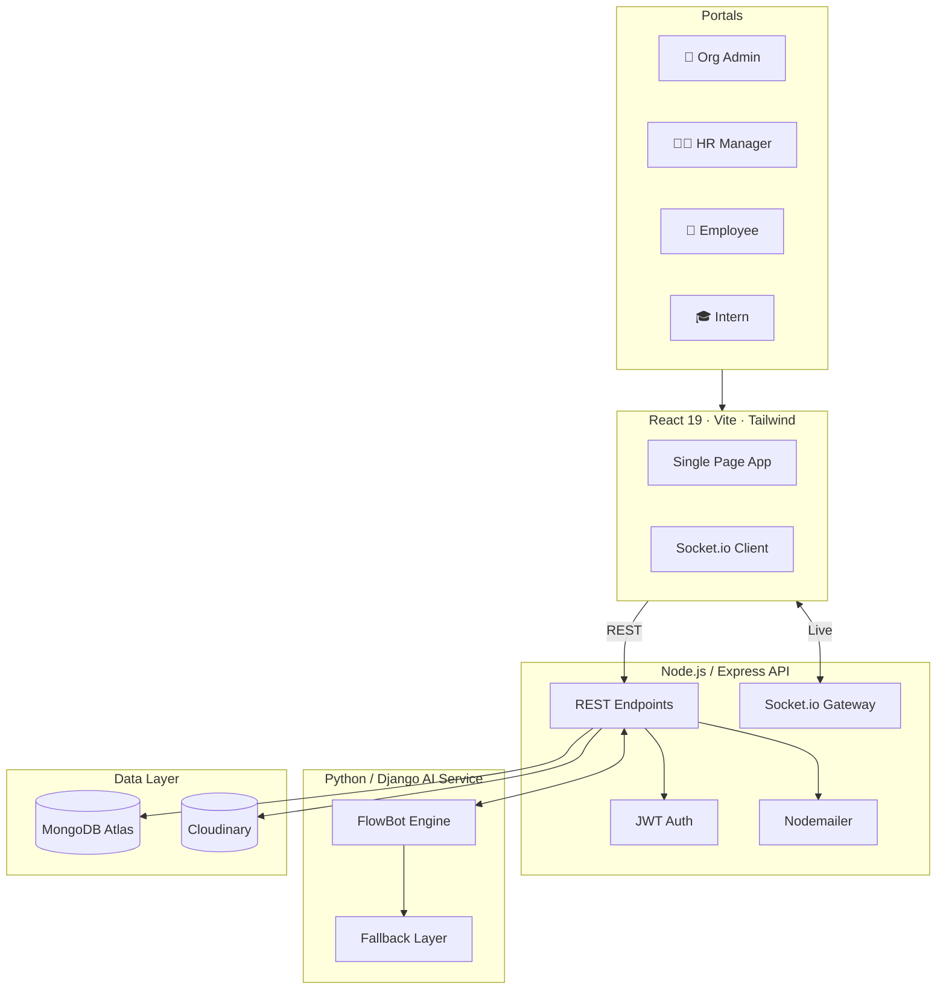
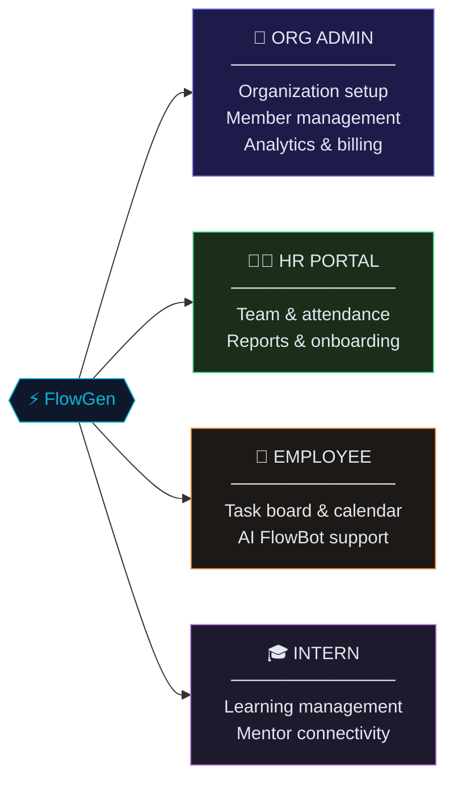
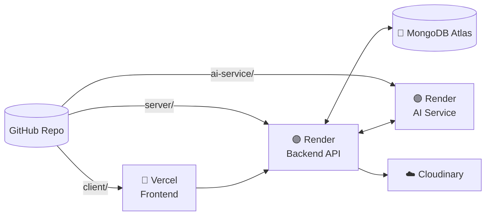

<div align="center">

```
███████╗██╗      ██████╗ ██╗    ██╗ ██████╗ ███████╗███╗   ██╗
██╔════╝██║     ██╔═══██╗██║    ██║██╔════╝ ██╔════╝████╗  ██║
█████╗  ██║     ██║   ██║██║ █╗ ██║██║  ███╗█████╗  ██╔██╗ ██║
██╔══╝  ██║     ██║   ██║██║███╗██║██║   ██║██╔══╝  ██║╚██╗██║
██║     ███████╗╚██████╔╝╚███╔███╔╝╚██████╔╝███████╗██║ ╚████║
╚═╝     ╚══════╝ ╚═════╝  ╚══╝╚══╝  ╚═════╝ ╚══════╝╚═╝  ╚═══╝
```

**The Intelligent Workforce Operating System**

[](LICENSE)
[](https://react.dev)
[](https://nodejs.org)
[](https://mongodb.com)
[](https://python.org)

> One platform for every role in your organization — admins, HR, employees, and interns — unified under a real-time, AI-powered workspace.

</div>

---

## Architecture



---

## Portals

FlowGen ships four role-specific portals, each tailored to what that user actually needs — nothing more, nothing less.



---

## 🚀 Quick Start

### Prerequisites
- **Node.js** 18+ ([Download](https://nodejs.org))
- **MongoDB** 6+ ([Download](https://www.mongodb.com/try/download/community) or use [MongoDB Atlas](https://www.mongodb.com/cloud/atlas))
- **Python** 3.10+ ([Download](https://www.python.org/downloads/))
- **Git** ([Download](https://git-scm.com/downloads))

### Installation

```bash
# 1. Clone the repository
git clone https://github.com/Mokshilxhah/Flowgen
cd flowgen

# 2. Setup Backend (Node.js)
cd server
npm install
cp .env.example .env
# Edit .env with your MongoDB URI and secrets
npm run seed  # Optional: seed with test data

# 3. Setup Frontend (React)
cd ../client
npm install
cp .env.example .env
# Edit .env: VITE_API_BASE_URL=http://localhost:5000/api/v1

# 4. Setup AI Service (Python/Django)
cd ../ai-service
pip install -r requirements.txt
cp .env.example .env
python manage.py migrate
```

### Running Development Servers

**Option 1: Using start-dev.bat (Windows)**
```bash
# From project root
start-dev.bat
```

**Option 2: Manual (All Platforms)**
```bash
# Terminal 1 - Backend
cd server
npm run dev

# Terminal 2 - Frontend  
cd client
npm run dev

# Terminal 3 - AI Service
cd ai-service
python manage.py runserver 8000
```

### Access the Application
- **Frontend:** http://localhost:5173
- **Backend API:** http://localhost:5000
- **AI Service:** http://localhost:8000
- **API Health:** http://localhost:5000/health

### 🎭 Seeded Accounts

The repository includes seeded data for two organizations. All credentials are in `Dumy_Data.md`.

**Quick Test Login:**
- **Org Admin:** admin@techcorp.flowgen.app / password123
- **HR Manager:** hr@techcorp.flowgen.app / password123
- **Employee:** john.doe@techcorp.flowgen.app / password123
- **Intern:** intern@techcorp.flowgen.app / password123

---

## 🎭 Role-Based Feature Matrix

| Feature | Org Admin | HR Manager | Employee | Intern |
| :--- | :---: | :---: | :---: | :---: |
| **Real-time Analytics** | ✅ | ✅ | ❌ | ❌ |
| **Member Management** | ✅ | ✅ | ❌ | ❌ |
| **Team Creation** | ❌ | ✅ | ❌ | ❌ |
| **Project Tracking** | ✅ | ✅ | ✅ | ✅ |
| **Kanban Task Board** | ❌ | ❌ | ✅ | ✅ |
| **AI FlowBot Support** | ❌ | ❌ | ✅ | ✅ |
| **Attendance Logging** | ❌ | ❌ | ✅ | ✅ |
| **Learning Path** | ❌ | ❌ | ❌ | ✅ |
| **Live Chat & Inbox** | ✅ | ✅ | ✅ | ✅ |

---

## Key Features

**Real-Time Everything** — Dashboards, notifications, and activity logs update live via Socket.io. No refresh, no delay.

**FlowBot AI** — Context-aware assistant that understands your tasks, deadlines, and meetings. Falls back gracefully to local system data when offline.

**Smart Attendance** — Geofence-ready check-in with duplicate prevention. HR sees it the moment it happens.

**Branded Emails** — Automated, premium HTML templates for invites, password resets, and alerts.

---

## Tech Stack

| Layer | Technologies |
| :--- | :--- |
| **Frontend** | React 19, Vite 8, Tailwind CSS, Zustand, TanStack Query, Framer Motion |
| **Backend** | Node.js, Express, Socket.io, JWT, Zod |
| **AI Service** | Python 3.10+, Django, Django REST Framework |
| **Database** | MongoDB Atlas (primary), SQLite (AI local) |
| **Storage** | Cloudinary |

---

## Deployment



| Service | Platform | Config |
| :--- | :--- | :--- |
| **Frontend** | Vercel | Build: `npm run build` · Set `VITE_API_BASE_URL` |
| **Backend** | Render | Start: `node src/index.js` · Add vars from `.env.example` |
| **AI Service** | Render | Start: `python manage.py runserver 0.0.0.0:$PORT` |
| **Database** | MongoDB Atlas | Whitelist `0.0.0.0/0` in Network Access |

> 💡 On Render's free tier, use [cron-job.org](https://cron-job.org) to ping `/health` every 14 minutes to prevent cold starts.

---

## License

MIT © [FlowGen Team](LICENSE)