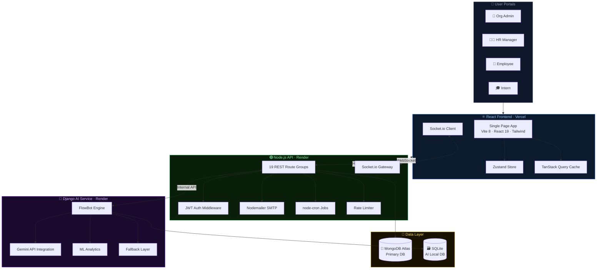
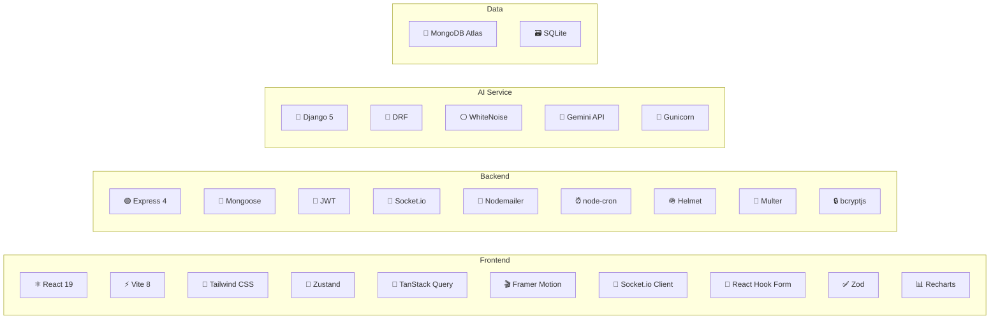
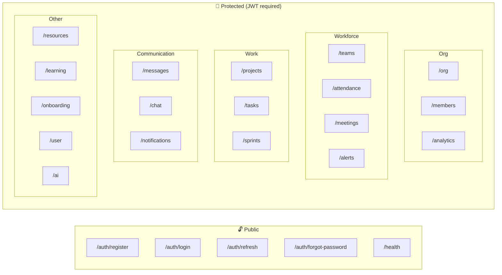
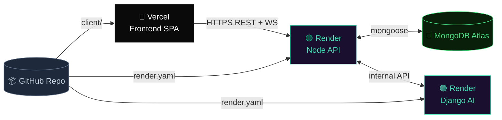
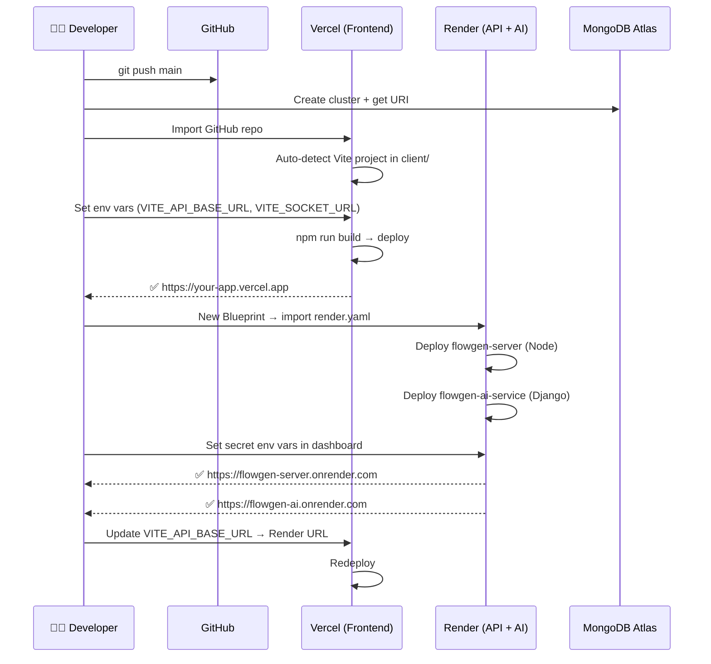
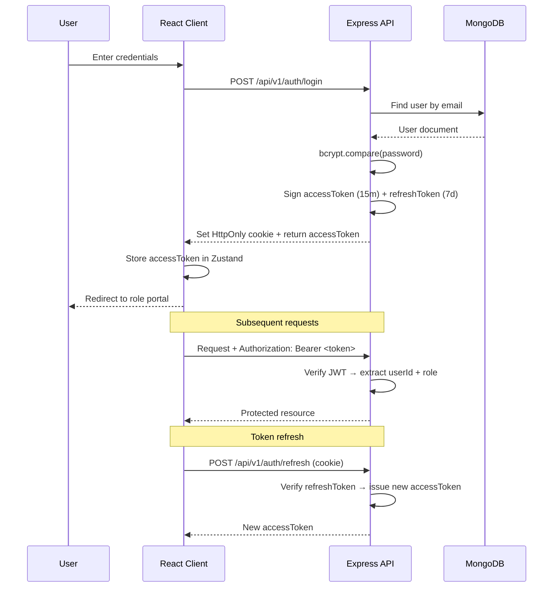
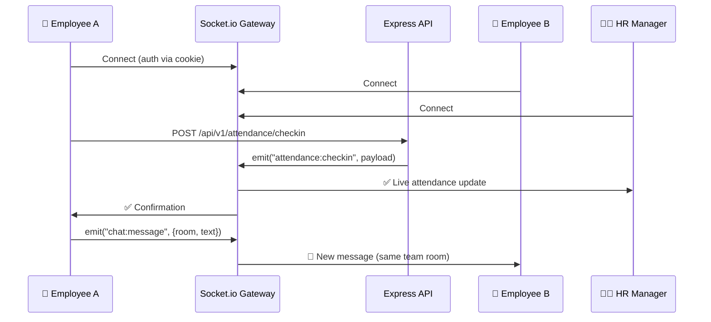

<div align="center">

```
███████╗██╗      ██████╗ ██╗    ██╗ ██████╗ ███████╗███╗   ██╗
██╔════╝██║     ██╔═══██╗██║    ██║██╔════╝ ██╔════╝████╗  ██║
█████╗  ██║     ██║   ██║██║ █╗ ██║██║  ███╗█████╗  ██╔██╗ ██║
██╔══╝  ██║     ██║   ██║██║███╗██║██║   ██║██╔══╝  ██║╚██╗██║
██║     ███████╗╚██████╔╝╚███╔███╔╝╚██████╔╝███████╗██║ ╚████║
╚═╝     ╚══════╝ ╚═════╝  ╚══╝╚══╝  ╚═════╝ ╚══════╝╚═╝  ╚═══╝
```

### **The Intelligent Workforce Operating System**

[](LICENSE)
[](https://react.dev)
[](https://nodejs.org)
[](https://mongodb.com)
[](https://python.org)
[](https://vercel.com)
[](https://render.com)

> **One platform for every role in your organization** — admins, HR, employees, and interns — unified under a real-time, AI-powered workspace.

</div>

---

## 📋 Table of Contents

- [Overview](#-overview)
- [System Architecture](#-system-architecture)
- [Portals & Role System](#-portals--role-system)
- [Feature Matrix](#-feature-matrix)
- [Tech Stack](#-tech-stack)
- [Project Structure](#-project-structure)
- [API Overview](#-api-overview)
- [Quick Start](#-quick-start)
- [Environment Variables](#-environment-variables)
- [Deployment](#-deployment)
- [Data Flow](#-data-flow)
- [Test Accounts](#-test-accounts)
- [Contributing](#-contributing)
- [License](#-license)

---

## 🌟 Overview

FlowGen is a **full-stack, multi-tenant SaaS** platform that replaces the patchwork of Slack, Jira, Google Meet, and HR tools with a single intelligent workspace. Every feature is real-time, role-aware, and AI-augmented via **FlowBot** — the built-in AI assistant powered by Google Gemini.

### Key Differentiators

| Capability | What it means |
|:---|:---|
| 🏢 **Multi-tenant** | Each organization is fully isolated — separate data, branding, and members |
| 🎭 **Role-based portals** | Every user sees exactly what their role needs — nothing more |
| ⚡ **Real-time everywhere** | Socket.io pushes live updates to dashboards, chats, notifications |
| 🤖 **AI-native** | FlowBot understands tasks, deadlines, meetings — not just keywords |
| 📧 **Branded emails** | Premium HTML email templates for invites, resets, and alerts |
| 🔐 **JWT + cookie auth** | Secure access + refresh token rotation with HttpOnly cookies |

---

## 🏗️ System Architecture



---

## 🎭 Portals & Role System

FlowGen ships **four role-specific portals**, each tailored to what that user actually needs.

```mermaid
flowchart TD
    LOGIN["🔐 Login / Register"] --> DETECT{"Role Detection\nvia JWT Claim"}

    DETECT -->|"org_admin"| ORG["👑 ORG ADMIN PORTAL"]
    DETECT -->|"hr_manager"| HR["🧑‍💼 HR PORTAL"]
    DETECT -->|"employee"| EMP["👷 EMPLOYEE PORTAL"]
    DETECT -->|"intern"| INT["🎓 INTERN PORTAL"]

    ORG --> ORG1["📊 Analytics Dashboard"]
    ORG --> ORG2["👥 Member Management"]
    ORG --> ORG3["📁 Projects Overview"]
    ORG --> ORG4["💳 Billing & Plans"]
    ORG --> ORG5["⚙️ Org Settings"]

    HR --> HR1["🏠 HR Dashboard"]
    HR --> HR2["👫 Teams Management"]
    HR --> HR3["📅 Attendance Reports"]
    HR --> HR4["📆 Meetings & Calendar"]
    HR --> HR5["⚠️ Smart Alerts"]
    HR --> HR6["📋 Onboarding Reports"]

    EMP --> EMP1["🏠 Employee Dashboard"]
    EMP --> EMP2["📋 Kanban Task Board"]
    EMP --> EMP3["📆 Calendar"]
    EMP --> EMP4["💬 Team Chat"]
    EMP --> EMP5["📬 Inbox / Messages"]

    INT --> INT1["🏠 Intern Dashboard"]
    INT --> INT2["📚 Learning Path"]
    INT --> INT3["🤝 Mentor Connect"]
    INT --> INT4["📋 My Tasks"]

    style LOGIN fill:#1E293B,stroke:#06B6D4,color:#67E8F9
    style DETECT fill:#1E293B,stroke:#F59E0B,color:#FCD34D
    style ORG fill:#1E1B4B,stroke:#818CF8,color:#C7D2FE
    style HR fill:#1A2E1A,stroke:#4ADE80,color:#BBF7D0
    style EMP fill:#1C1917,stroke:#FB923C,color:#FED7AA
    style INT fill:#1E1A2E,stroke:#C084FC,color:#E9D5FF
```



---

## ✅ Feature Matrix

| Feature | 👑 Org Admin | 🧑‍💼 HR | 👷 Employee | 🎓 Intern |
|:---|:---:|:---:|:---:|:---:|
| **Analytics Dashboard** | ✅ Full | ✅ Limited | ❌ | ❌ |
| **Member Management** | ✅ Full | ✅ View | ❌ | ❌ |
| **Team Creation & Edit** | ❌ | ✅ | ❌ | ❌ |
| **Project Tracking** | ✅ | ✅ | ✅ Read | ❌ |
| **Kanban Task Board** | ❌ | ❌ | ✅ | ✅ |
| **AI FlowBot** | ❌ | ❌ | ✅ | ✅ |
| **Attendance Logging** | ❌ | ✅ Manage | ✅ Log own | ✅ Log own |
| **Smart HR Alerts** | ❌ | ✅ | ❌ | ❌ |
| **Meetings & Calendar** | ❌ | ✅ Full | ✅ View | ✅ View |
| **Live Chat** | ✅ | ✅ | ✅ | ✅ |
| **Inbox / Messaging** | ✅ | ✅ | ✅ | ✅ |
| **Learning Path** | ❌ | ❌ | ❌ | ✅ |
| **Mentor Connect** | ❌ | ❌ | ❌ | ✅ |
| **Billing & Plans** | ✅ | ❌ | ❌ | ❌ |
| **Org Settings** | ✅ | ❌ | ❌ | ❌ |
| **Reports Export** | ❌ | ✅ | ❌ | ❌ |

---

## 🛠️ Tech Stack



### Detailed Stack Table

| Layer | Technology | Version | Purpose |
|:---|:---|:---:|:---|
| **Frontend Framework** | React | 19 | Component-based UI |
| **Build Tool** | Vite | 8 | Fast HMR & bundling |
| **Styling** | Tailwind CSS | 3.4 | Utility-first CSS |
| **State Management** | Zustand | 5 | Global client state |
| **Server State** | TanStack Query | 5 | Async data + caching |
| **Animations** | Framer Motion | 12 | Premium UI animations |
| **Forms** | React Hook Form + Zod | 7 / 4 | Validation & forms |
| **Charts** | Recharts | 3 | Analytics visualizations |
| **Drag & Drop** | dnd-kit | 6 | Kanban board |
| **Backend Runtime** | Node.js + Express | 18+ / 4 | REST API server |
| **Real-time** | Socket.io | 4 | Bidirectional events |
| **Authentication** | JWT (access + refresh) | 9 | Secure token auth |
| **Database ORM** | Mongoose | 8 | MongoDB schema/query |
| **Primary Database** | MongoDB Atlas | 6+ | Document storage |
| **Email** | Nodemailer | 8 | Transactional email |
| **Rate Limiting** | express-rate-limit | 7 | API abuse prevention |
| **Security** | Helmet | 7 | HTTP security headers |
| **File Uploads** | Multer | 1.4 | Multipart form data |
| **AI Framework** | Django + DRF | 5 / 3.14 | AI REST microservice |
| **AI Provider** | Google Gemini | — | FlowBot intelligence |
| **Python Server** | Gunicorn | 21 | Production WSGI server |
| **Static Files** | WhiteNoise | 6 | Django static serving |
| **AI Database** | SQLite | — | AI service local DB |

---

## 📁 Project Structure

```
flowgen/
├── 📄 render.yaml              ← Multi-service Render deployment blueprint
├── 📄 start-dev.bat            ← Windows one-command dev launcher
├── 📄 .gitignore               ← Root gitignore (all services)
│
├── client/                     ← ⚛️  React + Vite Frontend
│   ├── src/
│   │   ├── components/         ← Reusable UI components
│   │   ├── pages/
│   │   │   ├── auth/           ← Login, Register, Reset
│   │   │   ├── org/            ← Org Admin portal pages
│   │   │   ├── hr/             ← HR Manager portal pages
│   │   │   ├── employee/       ← Employee portal pages
│   │   │   ├── intern/         ← Intern portal pages
│   │   │   ├── landing/        ← Public landing page
│   │   │   └── shared/         ← Pages shared across roles
│   │   ├── store/              ← Zustand global state stores
│   │   ├── lib/                ← Axios instance, QueryClient, utils
│   │   ├── router/             ← React Router v7 config
│   │   └── utils/              ← Utility helpers
│   ├── .env.example            ← Client env template
│   ├── vercel.json             ← Vercel SPA rewrite rules
│   └── vite.config.js          ← Vite build config (code-split)
│
├── server/                     ← 🟢 Node.js / Express Backend
│   ├── src/
│   │   ├── app.js              ← Express app setup (CORS, middleware)
│   │   ├── index.js            ← Entry point (HTTP + Socket.io)
│   │   ├── config/             ← DB, socket, environment config
│   │   ├── controllers/        ← Business logic handlers
│   │   ├── middleware/         ← Auth, rate-limit, tenant, error
│   │   ├── models/             ← Mongoose schemas
│   │   ├── routes/             ← 19 API route groups
│   │   ├── services/           ← Email, AI bridge, notifications
│   │   ├── templates/          ← HTML email templates
│   │   ├── utils/              ← Cron jobs, helpers
│   │   └── validators/         ← Zod request validators
│   ├── seed/
│   │   ├── seed.js             ← Populate DB with demo organizations
│   │   └── clear.js            ← Wipe seed data
│   ├── uploads/
│   │   └── .gitkeep            ← Upload directory placeholder
│   ├── .env.example            ← Server env template
│   └── package.json
│
└── ai-service/                 ← 🐍 Python / Django AI Microservice
    ├── flowgen_ai/             ← Django project settings
    ├── ai_chat/                ← FlowBot chat endpoints
    ├── ai_assistant/           ← AI assistant logic
    ├── analytics_ml/           ← ML analytics module
    ├── manage.py               ← Django management CLI
    ├── requirements.txt        ← Python dependencies
    ├── Procfile                ← Gunicorn start command
    ├── .env.example            ← AI service env template
    └── .gitignore
```

---

## 🔌 API Overview

All endpoints are prefixed `/api/v1`. Authentication via `Authorization: Bearer <token>` or `HttpOnly` cookie.



| Group | Routes | Description |
|:---|:---|:---|
| **Auth** | `/auth/*` | Register, login, refresh, password reset, email verify |
| **Organization** | `/org/*` | CRUD org, settings, overview |
| **Members** | `/members/*` | Invite, manage, remove members |
| **Analytics** | `/analytics/*` | Org-wide statistics and reports |
| **Teams** | `/teams/*` | Create teams, assign members |
| **Projects** | `/projects/*` | Project CRUD, progress tracking |
| **Tasks** | `/tasks/*` | Kanban tasks, status transitions |
| **Sprints** | `/sprints/*` | Sprint planning and tracking |
| **Attendance** | `/attendance/*` | Check-in/out, HR reports |
| **Meetings** | `/meetings/*` | Schedule, update, join meetings |
| **Alerts** | `/alerts/*` | HR smart alerts and thresholds |
| **Messages** | `/messages/*` | DM inbox system |
| **Chat** | `/chat/*` | Real-time group/team chat |
| **Notifications** | `/notifications/*` | Push notification log |
| **Resources** | `/resources/*` | Company resource library |
| **Learning** | `/learning/*` | Intern learning paths |
| **Onboarding** | `/onboarding/*` | New member onboarding flow |
| **User** | `/user/*` | Profile, settings, avatar |
| **AI** | `/ai/*` | FlowBot bridge to AI service |

---

## 🚀 Quick Start

### Prerequisites

| Requirement | Version | Download |
|:---|:---|:---|
| **Node.js** | 18+ | [nodejs.org](https://nodejs.org) |
| **MongoDB** | 6+ | [MongoDB Atlas](https://www.mongodb.com/cloud/atlas) or [Community](https://www.mongodb.com/try/download/community) |
| **Python** | 3.10+ | [python.org](https://www.python.org/downloads/) |
| **Git** | Any | [git-scm.com](https://git-scm.com/downloads) |

### Installation

```bash
# 1. Clone the repository
git clone https://github.com/Mokshilxhah/Flowgen
cd Flowgen
```

**Backend (Node.js)**
```bash
cd server
npm install
cp .env.example .env
# ✏️  Edit .env — set MONGODB_URI and JWT secrets
npm run seed    # Optional: populate with demo data
```

**Frontend (React)**
```bash
cd ../client
npm install
cp .env.example .env
# ✏️  Edit .env — set VITE_API_BASE_URL=http://localhost:5000/api/v1
```

**AI Service (Python)**
```bash
cd ../ai-service
python -m venv venv
# Windows:
venv\Scripts\activate
# macOS/Linux:
source venv/bin/activate

pip install -r requirements.txt
cp .env.example .env
# ✏️  Edit .env — set GEMINI_API_KEY and NODE_BACKEND_API_KEY
python manage.py migrate
```

### Running in Development

**Option 1 — Windows one-click:**
```bash
# From project root
start-dev.bat
```

**Option 2 — Manual (all platforms):**
```bash
# Terminal 1 — Backend API
cd server && npm run dev

# Terminal 2 — Frontend
cd client && npm run dev

# Terminal 3 — AI Service
cd ai-service && python manage.py runserver 8000
```

### Local URLs

| Service | URL | Description |
|:---|:---|:---|
| **Frontend** | http://localhost:5173 | React app |
| **Backend API** | http://localhost:5000 | Express REST API |
| **AI Service** | http://localhost:8000 | Django AI service |
| **Health Check** | http://localhost:5000/health | API status |

---

## 🔑 Environment Variables

### `client/.env`

```env
VITE_API_BASE_URL=http://localhost:5000/api/v1
VITE_SOCKET_URL=http://localhost:5000
```

### `server/.env`

| Variable | Example | Required |
|:---|:---|:---:|
| `PORT` | `5000` | ✅ |
| `NODE_ENV` | `production` | ✅ |
| `MONGODB_URI` | `mongodb+srv://...` | ✅ |
| `JWT_ACCESS_SECRET` | *(random 64-char string)* | ✅ |
| `JWT_REFRESH_SECRET` | *(random 64-char string)* | ✅ |
| `JWT_ACCESS_EXPIRES` | `15m` | ✅ |
| `JWT_REFRESH_EXPIRES` | `7d` | ✅ |
| `CLIENT_URL` | `https://flowgen.vercel.app` | ✅ |
| `AI_SERVICE_URL` | `https://flowgen-ai.onrender.com` | ✅ |
| `SMTP_HOST` | `smtp.gmail.com` | ✅ |
| `SMTP_PORT` | `587` | ✅ |
| `SMTP_USER` | `your@gmail.com` | ✅ |
| `SMTP_PASS` | *(Gmail App Password)* | ✅ |
| `NODE_BACKEND_API_KEY` | *(shared secret with AI)* | ✅ |
| `RAZORPAY_KEY_SECRET` | *(from Razorpay dashboard)* | ⚠️ Optional |
| `BILLING_SIMULATE` | `true` | ✅ |

### `ai-service/.env`

| Variable | Example | Required |
|:---|:---|:---:|
| `SECRET_KEY` | *(Django secret key)* | ✅ |
| `DEBUG` | `False` | ✅ |
| `ALLOWED_HOSTS` | `*.onrender.com` | ✅ |
| `GEMINI_API_KEY` | *(from Google AI Studio)* | ✅ |
| `NODE_BACKEND_URL` | `https://flowgen-api.onrender.com/api/v1` | ✅ |
| `NODE_BACKEND_API_KEY` | *(must match server)* | ✅ |
| `CORS_ALLOWED_ORIGINS` | `https://flowgen.vercel.app` | ✅ |
| `OPENAI_API_KEY` | *(optional fallback)* | ⚠️ Optional |

---

## 🚢 Deployment



### Step-by-Step Deployment



### Platform Configuration

| Service | Platform | Build Command | Start Command | Key Env Vars |
|:---|:---|:---|:---|:---|
| **Frontend** | Vercel | `npm run build` | *(Vercel handles)* | `VITE_API_BASE_URL`, `VITE_SOCKET_URL` |
| **Node API** | Render | `npm install --production` | `node src/index.js` | `MONGODB_URI`, `JWT_*`, `CLIENT_URL`, `AI_SERVICE_URL` |
| **Django AI** | Render | `pip install -r requirements.txt && python manage.py migrate` | `gunicorn flowgen_ai.wsgi:application` | `SECRET_KEY`, `GEMINI_API_KEY`, `NODE_BACKEND_*` |
| **Database** | MongoDB Atlas | *(managed)* | *(managed)* | Whitelist `0.0.0.0/0` in Network Access |

> 💡 **Free tier tip:** On Render's free tier, services sleep after 15 minutes of inactivity. Use [cron-job.org](https://cron-job.org) to ping `/health` and `/health/` every 14 minutes to prevent cold starts.

> 💡 **Render Blueprint:** A `render.yaml` is included at the project root. On Render, create a new **Blueprint** and point it to your repo — both services will be detected and configured automatically.

---

## 🌊 Data Flow

### Authentication Flow



### Real-Time Event Flow



---

## 🎭 Test Accounts

The repository includes seed data for two demo organizations. Run `npm run seed` in the `server/` directory first.

> All credentials are documented in `Dumy_Data.md` (local reference only, not committed).

### Organization: TCS (Demo)

| Role | Name | Email | Password |
|:---|:---|:---|:---|
| 👑 **Org Admin** | Mokshil | `mokshil@tcs.flowgen.app` | `@#$Mokshil123` |
| 🧑‍💼 **HR Manager** | Dolen | `dolen@tcs.flowgen.app` | `@#$Dolen123` |
| 👷 **Employee** | Rahul | `rahul@tcs.flowgen.app` | `@#$Rahul123` |
| 🎓 **Intern** | Alex | `alex@tcs.flowgen.app` | `@#$Alex123` |

> Alias emails also work: `admin@tcs.flowgen.app`, `hr@tcs.flowgen.app`, `intern@tcs.flowgen.app`

---

## 🤝 Contributing

1. **Fork** the repository
2. Create a feature branch: `git checkout -b feature/amazing-feature`
3. Commit your changes: `git commit -m 'feat: add amazing feature'`
4. Push to the branch: `git push origin feature/amazing-feature`
5. Open a **Pull Request**

### Commit Convention

| Prefix | Use case |
|:---|:---|
| `feat:` | New feature |
| `fix:` | Bug fix |
| `docs:` | Documentation changes |
| `style:` | Code style (no logic change) |
| `refactor:` | Code restructure |
| `test:` | Tests |
| `chore:` | Build / tooling / deps |

---

## 📄 License

MIT © [FlowGen Team](LICENSE)

---

<div align="center">

Built with ❤️ by the FlowGen Team

⭐ **Star this repo** if FlowGen helped you!

</div>